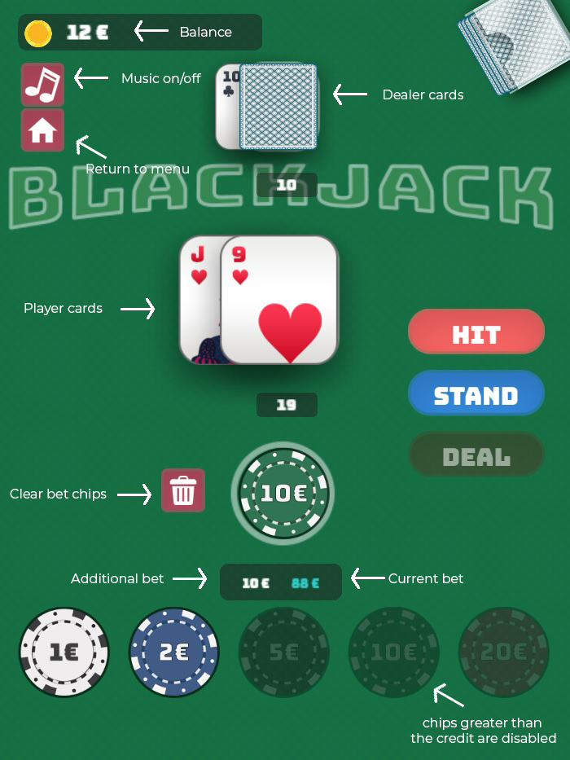

## How to install?

* Clone the repo
  ```
  git clone https://github.com/ErdemYesiltas/black-jack.git
  ```
* Install game dependencies
  ```
  npm install
  ```

## How to run ?

* Run project on watch mode

```
  npm run watch
```

* Or build mode

```
  npm run build
```

* Run live server

```
  npm run serve
```

* Open your browser and type [http://localhost:3000](http://localhost:3000) or [http://localhost:3000/dev.html](http://localhost:3000/dev.html) for development

## Demo link

Please click [here](https://main.d2qlrdceyfu3l.amplifyapp.com/) for demo game.

## How to play?

* If you are playing the game for the first time you will be greeted by this screen. You can start a new session to start the game by clicking on the Start button.


* If you already had a saved game session you will be greeted by the screen below. You can continue the game from where you left off by clicking on Resume button. You can also start a new game session using the Reset button.


* Enjoy your game !

  
* If you run out of credit you will encounter a popup as shown below. Here you can deposit, reset your session or return the game scene.

  
